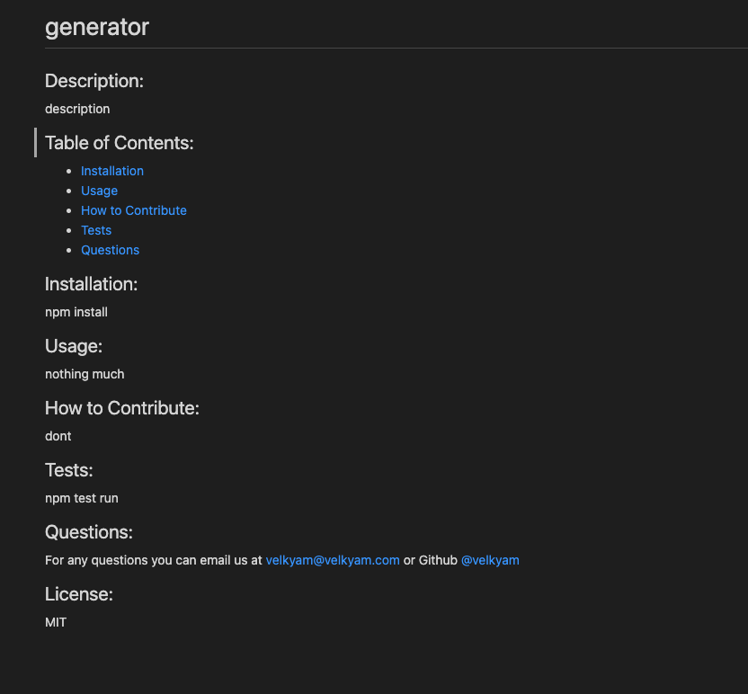

# readme-generator

## Description
The goal of this project was to create a professional README generator to ease the pain of starting new coding projects and writing one from scratch. README files usually have relatively standarized format, which is why the README generator allows the users to generate README by inquiring most common information. 

## [Link to video:](https://youtu.be/XAdMK7FK6XU)

https://youtu.be/XAdMK7FK6XU

To edit this project:

1. Create a new repository on your GitHub account and clone it to your computer.

2. Copy this project to your local repository.

3. NPM Install

4. Make changes.

4. When you're ready to deploy, use the git add, git commit, git pull and git push commands to save and push your code to your GitHub repository.

MIT License

Copyright (c) [2021] [DatNguyen]

Permission is hereby granted, free of charge, to any person obtaining a copy of this software and associated documentation files (the "Software"), to deal in the Software without restriction, including without limitation the rights to use, copy, modify, merge, publish, distribute, sublicense, and/or sell copies of the Software, and to permit persons to whom the Software is furnished to do so, subject to the following conditions:

The above copyright notice and this permission notice shall be included in all copies or substantial portions of the Software.

THE SOFTWARE IS PROVIDED "AS IS", WITHOUT WARRANTY OF ANY KIND, EXPRESS OR IMPLIED, INCLUDING BUT NOT LIMITED TO THE WARRANTIES OF MERCHANTABILITY, FITNESS FOR A PARTICULAR PURPOSE AND NONINFRINGEMENT. IN NO EVENT SHALL THE AUTHORS OR COPYRIGHT HOLDERS BE LIABLE FOR ANY CLAIM, DAMAGES OR OTHER LIABILITY, WHETHER IN AN ACTION OF CONTRACT, TORT OR OTHERWISE, ARISING FROM, OUT OF OR IN CONNECTION WITH THE SOFTWARE OR THE USE OR OTHER DEALINGS IN THE SOFTWARE.